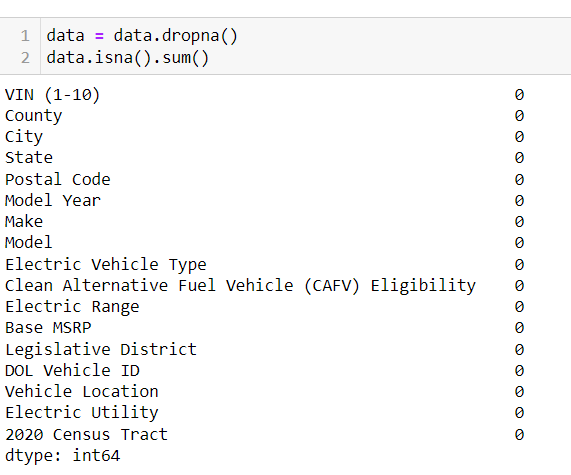
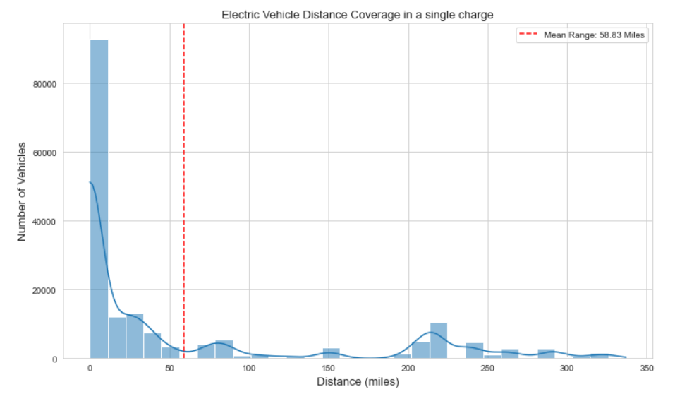

# Electric Vehicles Market Size Analysis using Python
 A tool designed to perform market size analysis, helping businesses determine potential sales volume, understand demand, assess market saturation, and identify growth opportunities. 

## 1. Read and perform EDA:
**First, we will check if there is any null values in our dataset:**

There are numerous ways we can handle the missing data, but in this case, we will drop them.

**Dropping the missing values:**

**Checking the data types:**

Everything seems good, now we will move on to the analysis. If the data types we not in the preferred format then we would have to change their types but here, everything seems good.

## 2. Increment in the EV over the year:

There seems to be a gradual increment in the registration of the EV with 2023 being the highest. This dataset only contains
a few records for the year 2024, so the bar chart seems small.

## 3. Top 10 EV based counties and cities:
This dataset is for the US, so all the counties and the cities are from the US.

 
 
Out of top-10 cities, majority of the cities are from King County, where 8 are from King, and remaining 2 are from Snohomish and Pierce each.
Seattle has the highest number of EV registration count with 29,447 registration sitting at the top of the chart being the most EV registered city. The difference is quite huge compared to Seattle. 

## 4. Understanding BEVs and PHEVs distribution:
**BEVs:** Battery Electric Vehicles

**PHEVs:** Plug-in Hybrid Electric Vehicles
 

Compared to PHEVs, the number of BEVs is significantly higher, which is encouraging. The growing number of people shifting to fully electric vehicles is a positive sign that more are becoming mindful of emissions and their environmental impact.

## 5. Analyzing the 10 EV manufacturers:

TESLA is the most dominant company in the field of EV. There is a huge difference even between the TESLA and NISSAN which
is at the second position.
TESLA, NISSAN, and CHEVROLET are the top 3 EV companies based on the data we have, now let's analyze their products.

## 6. Analyzing models of top-3 EV Companies:

The graph above shows how many electric vehicles from the top three manufacturers—TESLA, NISSAN, and CHEVROLET—are registered, broken down by model. Here's what it shows:

TESLA’s MODEL Y and MODEL 3 are the most popular, with MODEL Y having the highest number of registrations. NISSAN’s LEAF is the third most popular and the top non-TESLA model. TESLA’s MODEL S and MODEL X also have a lot of registrations. CHEVROLET’s BOLT EV and VOLT follow with a good number of registrations, and BOLT EUV is next. NISSAN’s ARIYA and CHEVROLET’s SPARK have the fewest registrations among the models listed.

## 7. Analyzing the Distance Coverage On a Single Charge:

This chart shows the number of vehicles (Y-axis) that can travel the distance(X-axis) in a single charge in Miles.

The red dotted line represents the
mean distance which is also represented as the legend i.e. 58.83 Miles but the data is skewed positively. The mean distance
is relatively low compared to the distance ranges that the vechicle can cover. 

## 8. Anlayzing the improvement in battery life over the years:
Now, lets see how the improvements on the battery power over the years. There have so much development in the machinery
and technological advancement. Will it also be reflected in the distance ranges covered by these EVs on a single charge or 
not, lets find it out.

From the year 1997 till 2010 there seems to be a good upward trend but there's a significant drop after the year
2010. It could be due to incomplete data but again it reaches its highest peak around the year 2020 and again there is a
a sharp decline but it seems to be recovering slightly yet again.

## 9. Analyzing the distance range among the top 3 manufacturers of the EV:

Here also Tesla takes the top 2 spots with ROADSTER and MODEL S based on the average distance covered on a single charge.
CHEVROLET being at the second position with 4 of its model being at the top 10 and finally NISSAN has just 1 model in the top
10.

## 10. Summary:
Market size analysis is an important part of market research that estimates how much can be sold in a market. It helps businesses see how much demand there is, how crowded the market is, and where there might be room to grow. From our analysis of the electric vehicle market, we see a bright future, showing that more people are interested in EVs and that there could be more investment and business opportunities in this industry.
